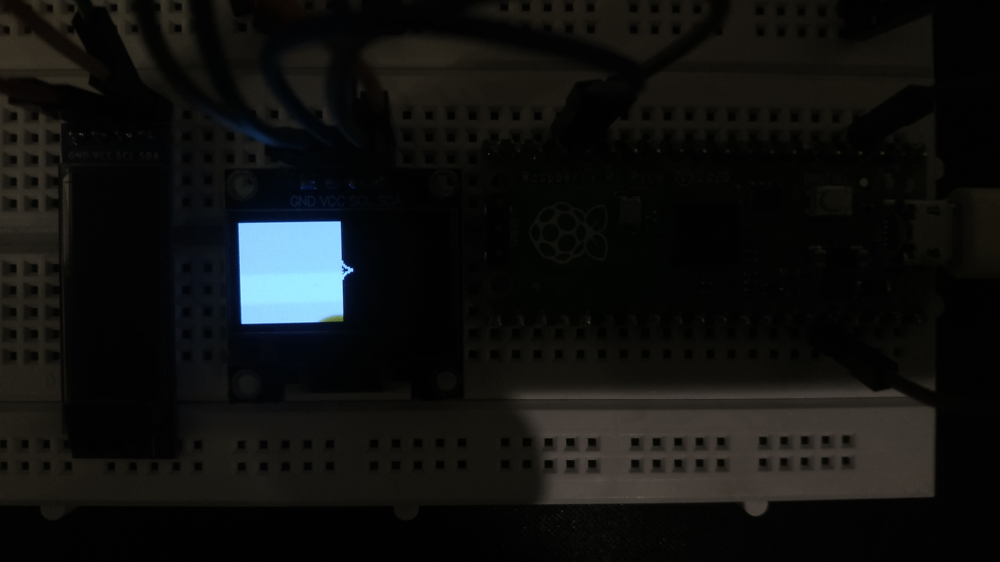
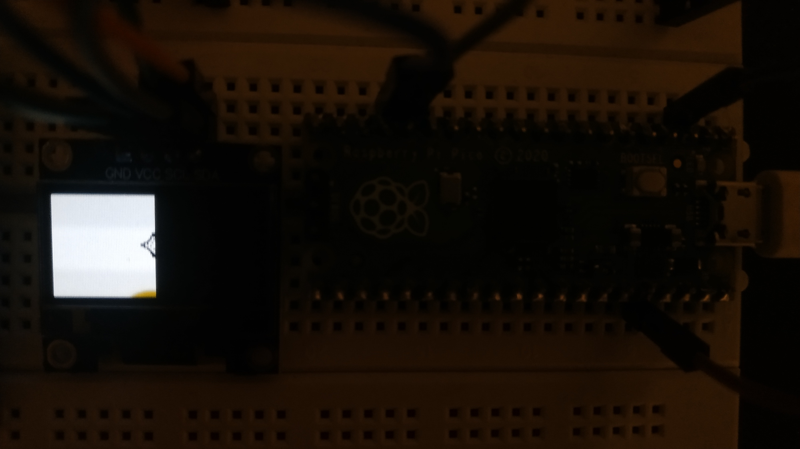
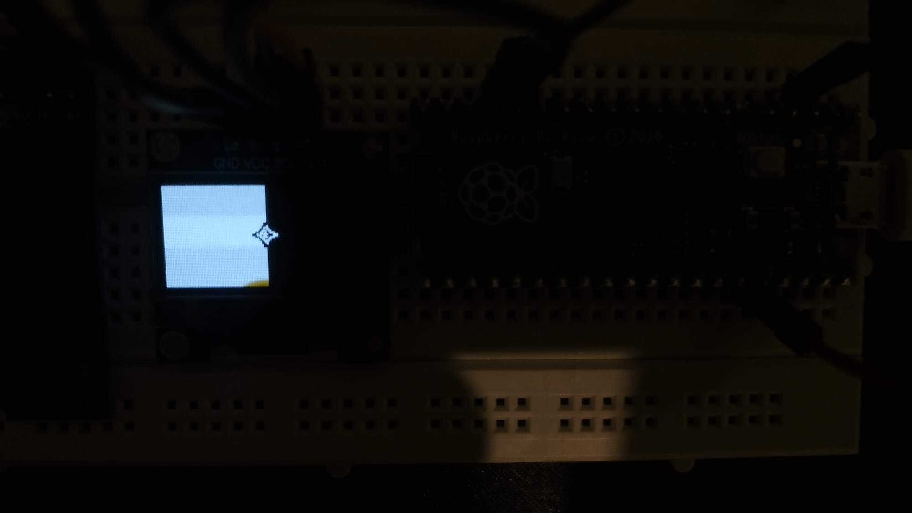

# This examples produces such a result

## Ignore yellow at the bottom (that's just my screen dying from hours of testing and development and some abuse)

### WriteMode::ADD

### WriteMode::SUBTRACT

### WriteMode::INVERT

