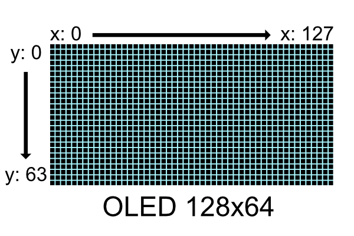

# SSD1306 OLED Library for RP2040

## 1. Importing the library
* Clone this project into your pico project
* Add this to your CMakeLists.txt
  ```cmake
    add_subdirectory(pico-ssd1306)
    target_link_libraries(your_project_name
    pico_ssd1306
    # you will also need hardware i2c library for communication with the display
    hardware_i2c)
  ```
* Import library in your code
  ```c++
  #include "pico-ssd1306/ssd1306.h"
  ```
## 2. Basic usage
```c++
i2c_init(I2C_PORT, 1000000); //Use i2c port with baud rate of 1Mhz
//Set pins for I2C operation
gpio_set_function(I2C_PIN_SDA, GPIO_FUNC_I2C);
gpio_set_function(I2C_PIN_SCL, GPIO_FUNC_I2C);
gpio_pull_up(I2C_PIN_SDA);
gpio_pull_up(I2C_PIN_SCL);

//Create a new display object
pico_ssd1306::SSD1306 display = pico_ssd1306::SSD1306(I2C_PORT, 0x3D, pico_ssd1306::Size::W128xH64);

//create a vertical line on x: 64 y:0-63
for (int y = 0; y < 64; y++){
    display.setPixel(64, y);
}
display.sendBuffer(); //Send buffer to device and show on screen
```
### Expected output:
 

You may have noticed that this entire library is under pico_ssd1306 namespace to avoid conflicts, but if you don't have any
conflicts and don't want to write ```pico_ssd1306::``` all the time just add 
```c++
using namespace pico_ssd1306;
```
to your file

## 3. Principles of operation
See [usage explanation](usage.md) for detailed information on how to use core of the lib, but in short:
* First Initialize i2c and pins for i2c communication
* Create a display object. This automatically send setup commands to the device and prepares it for operation
* Modify the buffer containing pixel data
* Send buffer to display
* Clear the buffer and repeat

## 4. Pixel Addressing


same is true for 128x32 displays, then y range is 0-31

## 5. Additional Modules
This library comes with additional modules for shape rendering and text rendering to make your life easier
### Importing Shape Renderer
```c++
#include "pico-ssd1306/shapeRenderer/ShapeRenderer.h"
```
See: [Shape Renderer readme](shapeRenderer/readme.md) for usage and details
### Importing Text Renderer
```c++
#include "pico-ssd1306/textRenderer/TextRenderer.h"
```
See: [Text Renderer readme](textRenderer/readme.md) for usage and details

## 6. Examples
See [examples](examples). Many of them have their own readmes. Many things are also explained in code comments.

## 7. Documentation
Documentation of all functions is [here](https://ssd1306.harbys.me)
