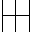
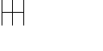
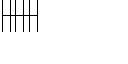

# Using the core library

## 1. Setting up the i2c ports
In order to communicate with the display you need to set up pico's i2c communication

### Add hardware_i2c library to CMakeLists.txt
```cmake
target_link_libraries(project_name
        hardware_i2c)
```

### Add the ssd1306 library to your project
This is explained in [readme.md](readme.md) section 1


### Set up i2c
Pico has 2 i2c controllers. You can use any of these, just remember to pass according i2c instance in code

for this example pins 12 and 13 are used for sda and scl lines. These are connected to i2c0 controller. You can use any 
pins capable of i2c communication but if they are connected to i2c1 controller you'll need to change the code when 
initializing i2c communication and when creating a display object

#### imports:
you need 
```c++
#include "hardware/i2c.h"
#include "pico-ssd1306/ssd1306.h"
```
i2c init and pin init:
```c++
    i2c_init(i2c0, 1000000); // Init i2c0 and set baud rate to 1Mhz (max supported speed by pico)
    // lower baud rates make the communication slower, and since this lib uses blocking writing,
    // lower baud rates lower maximal achievable frame rate
    gpio_set_function(12, GPIO_FUNC_I2C); // Set pins 12 and 13 for i2c role
    gpio_set_function(13, GPIO_FUNC_I2C);
    gpio_pull_up(12); // Pull up the pins for proper communication
    gpio_pull_up(13);
```

##  2. Create a display object
When creating a display object you need to provide 3 arguments. Witch i2c controller you want to use (the one you 
initialized above), display address (usually 0x3C or 0x3D with ssd1306) and display size. This library defines 2
available sizes Size::W128xH64 and Size::W128xH32 
```c++
pico_ssd1306::SSD1306 display = pico_ssd1306::SSD1306(i2c0, 0x3D, pico_ssd1306::Size::W128xH64);
```

## 3. A few words on how this works
From now on you can use the display object to draw anything you want to the display.
Core of ssd1306 library exposes 2 functions for drawing (documentation of all functions is here [doxygen](https://ssd1306.harbys.me)).
```setPixel()``` and ```addBitmapImage()``` but just calling these won't draw anything on screen. These functions only affect the buffer.
To actually display something you need to first draw to buffer (by ```setPixel()``` or ```addBitmapImage()```) and then sending it to the
display with ```sendBuffer()```. Same is true for ```clear()``` function. It just clears the buffer, not the screen. so 
calling ```clear()``` and ```sendBuffer()``` will actually clear the display.

## 4. Turning on a pixel
```setPixel()``` is pretty self-explanatory. It modifies the state of exactly 1 pixel. Just give it the x and y coordinates,
optionally change the write mode and done. If you're confused about write mode see [doxygen](https://ssd1306.harbys.me) 
section about write mode. tldr write mode decides whether a pixel is to be set on, off or inverted (on to off and vice versa)

this example set pixel at x = 0 and y = 0 (top left corner) on
```c++
//Create a new display object
pico_ssd1306::SSD1306 display = pico_ssd1306::SSD1306(I2C_PORT, 0x3D, pico_ssd1306::Size::W128xH64);

display.setPixel(0, 0);

display.sendBuffer();
```

## 5. Displaying an image

### How to prepare an image for pico
Well you can't just shove a png file into c++ and expect it to work. We need a bitmap containing data on which pixels
to turn on. This library scans bytes in bit map left to right, top to bottom, so :
```c++
#define IMAGE_WIDTH 32
#define IMAGE_HEIGHT 32
uint8_t image[128] = {
    0b00100000, 0b00000001, 0b00000000, 0b00000100, 
    0b00100000, 0b00000001, 0b00000000, 0b00000100, 
    0b00100000, 0b00000001, 0b00000000, 0b00000100, 
    0b00100000, 0b00000001, 0b00000000, 0b00000100, 
    0b00100000, 0b00000001, 0b00000000, 0b00000100, 
    0b00100000, 0b00000001, 0b00000000, 0b00000100, 
    0b00100000, 0b00000001, 0b00000000, 0b00000100, 
    0b00100000, 0b00000001, 0b00000000, 0b00000100, 
    0b00100000, 0b00000001, 0b00000000, 0b00000100, 
    0b00100000, 0b00000001, 0b00000000, 0b00000100, 
    0b00100000, 0b00000001, 0b00000000, 0b00000100, 
    0b00100000, 0b00000001, 0b00000000, 0b00000100, 
    0b00100000, 0b00000001, 0b00000000, 0b00000100, 
    0b00100000, 0b00000001, 0b00000000, 0b00000100, 
    0b00100000, 0b00000001, 0b00000000, 0b00000100, 
    0b00111111, 0b11111111, 0b11111111, 0b11111100, 
    0b00100000, 0b00000001, 0b00000000, 0b00000100, 
    0b00100000, 0b00000001, 0b00000000, 0b00000100, 
    0b00100000, 0b00000001, 0b00000000, 0b00000100, 
    0b00100000, 0b00000001, 0b00000000, 0b00000100, 
    0b00100000, 0b00000001, 0b00000000, 0b00000100, 
    0b00100000, 0b00000001, 0b00000000, 0b00000100, 
    0b00100000, 0b00000001, 0b00000000, 0b00000100, 
    0b00100000, 0b00000001, 0b00000000, 0b00000100, 
    0b00100000, 0b00000001, 0b00000000, 0b00000100, 
    0b00100000, 0b00000001, 0b00000000, 0b00000100, 
    0b00100000, 0b00000001, 0b00000000, 0b00000100, 
    0b00100000, 0b00000001, 0b00000000, 0b00000100, 
    0b00100000, 0b00000001, 0b00000000, 0b00000100, 
    0b00100000, 0b00000001, 0b00000000, 0b00000100, 
    0b00100000, 0b00000001, 0b00000000, 0b00000100, 
    0b00100000, 0b00000001, 0b00000000, 0b00000100 
};
```
contains such an image:

 

It's best to keep width to a number divisible by 8. Otherwise, errors occur while shifting bytes and rendering fails. 
Height does not have such a limitation.

### Bitmap to display
```addBitmapImage()``` function does pretty much all the work for us. we need to tell it what and where to draw and done.
So what do we need? x and y coordinated on where to anchor an image (anchor is top left point of the image), image and width, height.

```c++
display.addBitmapImage(0, 0, IMAGE_WIDTH, IMAGE_HEIGHT, image);
display.sendBuffer();
```
Should draw this image to display at point 0, 0

Entire display now should look like this:

 

Also note that ```addBitmapImage()``` in default write mode doesn't turn pixels off, so overlaying images is possible, so:

```c++
display.addBitmapImage(0, 0, IMAGE_WIDTH, IMAGE_HEIGHT, image);
display.addBitmapImage(8, 0, IMAGE_WIDTH, IMAGE_HEIGHT, image);
display.sendBuffer();
```
will overlay the same image with 8 pixel to right image, producing:



This function can take an optional argument of write mode, this is same as in ```setPixel()```

## 6. Additional Settings
### Things like setting contrast, flipping the display etc. are all documented [here](https://ssd1306.harbys.me)
